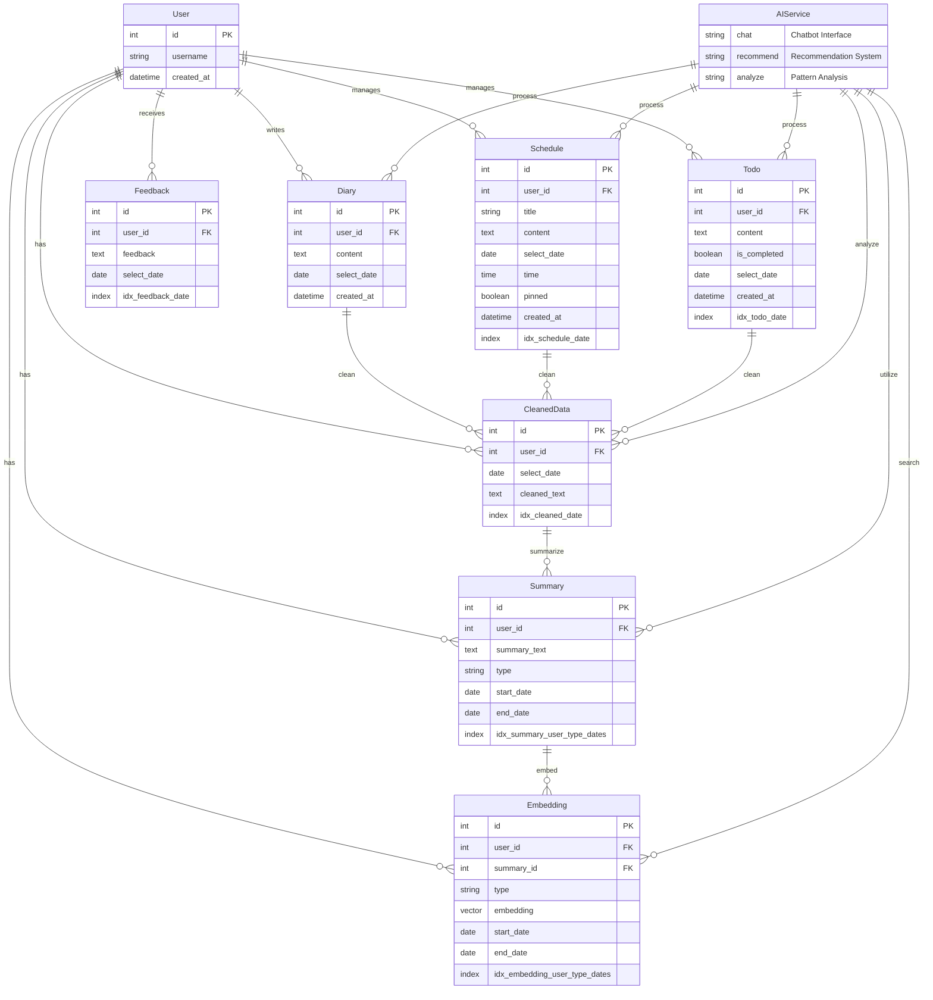
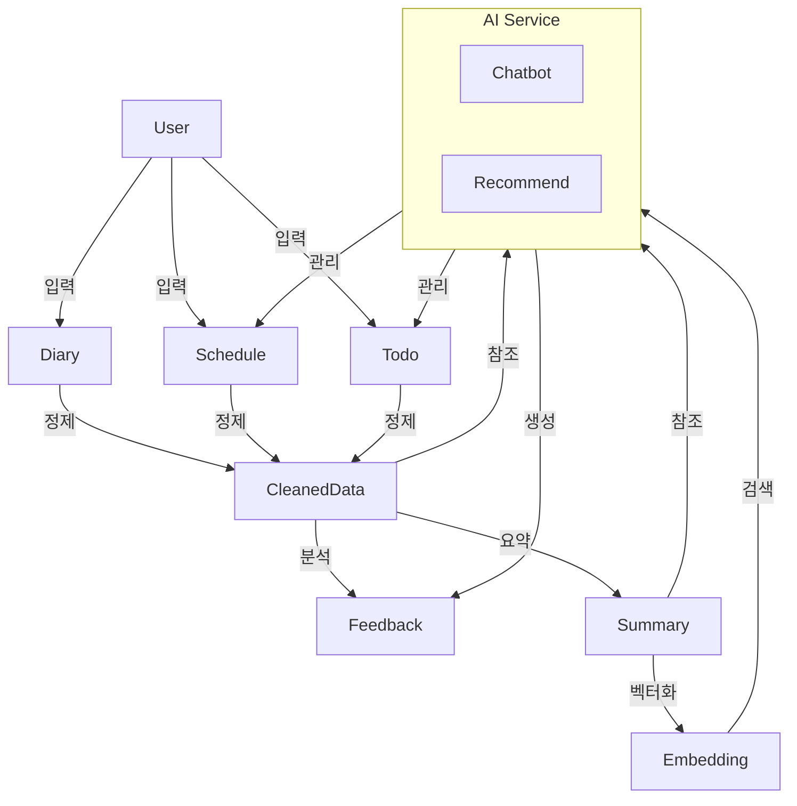

# MAIDDY AI 데이터베이스 ERD

## 데이터 흐름도

## 시스템 구성요소

### 데이터 저장소
- **User**: 사용자 정보
- **기본 데이터**: Diary, Schedule, Todo
- **가공 데이터**: CleanedData, Summary, Embedding
- **AI 결과**: Feedback

### AI 서비스
- **Chatbot**: 사용자 대화, 일정/할일 관리
- **Recommend**: 패턴 분석, 일정 추천

### 데이터 처리 흐름
1. **데이터 수집**: 사용자 입력 → 기본 데이터
2. **데이터 가공**: 기본 데이터 → CleanedData → Summary → Embedding
3. **AI 처리**: 가공 데이터 활용 → 챗봇 응답/추천

### 주요 프로세스
1. **일일 처리** (`scheduler.py`)
   - 데이터 정제 및 피드백 생성

2. **주간 처리** (`scheduler.py`)
   - 요약 생성 및 임베딩 생성

3. **실시간 처리** (`llm_service.py`)
   - 챗봇 대화 및 추천
