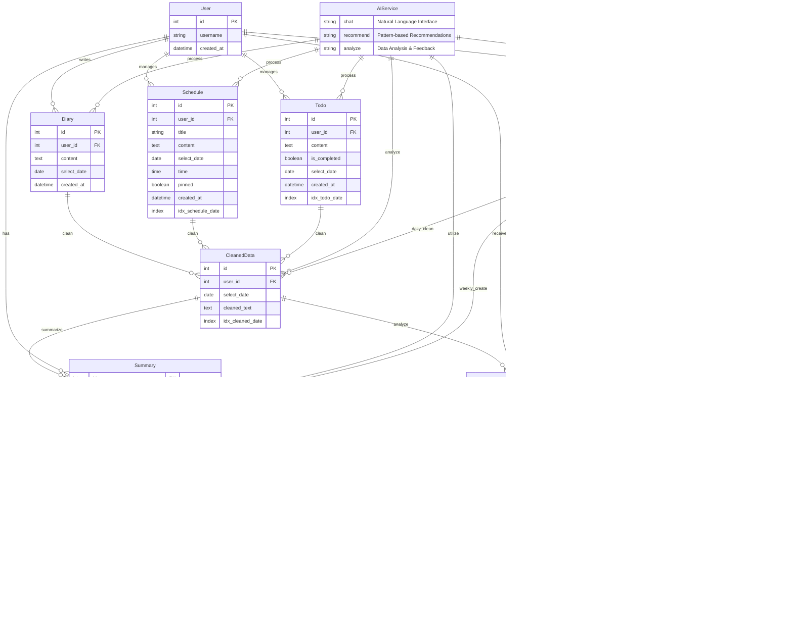

# MAIDDY AI 데이터베이스 ERD

## 데이터 처리 흐름도

## 시스템 구성

### 데이터 계층
1. **사용자 입력 데이터**
   - `Diary`: 사용자의 일기
   - `Schedule`: 일정 정보
   - `Todo`: 할일 목록

2. **AI 처리 데이터**
   - `CleanedData`: 정제된 통합 데이터
   - `Summary`: 주간/월간 요약
   - `Embedding`: 벡터화된 요약
   - `Feedback`: AI 생성 피드백

### 자동화 처리 (`scheduler.py`)
1. **일일 작업**
   - 매일 자정 실행
   - 전날 데이터 정제 (`CleanedData` 생성)
   - AI 피드백 생성 (`Feedback` 생성)

2. **주간 작업**
   - 매주 월요일 실행
   - 주간 요약 생성 (`Summary` 생성)
   - 요약 임베딩 생성 (`Embedding` 생성)

### AI 서비스 (`llm_service.py`)
1. **Chatbot**
   - 자연어 인터페이스
   - 일정/할일 관리
   - 맥락 기반 응답

2. **Recommend**
   - 패턴 기반 추천
   - 유사도 검색
