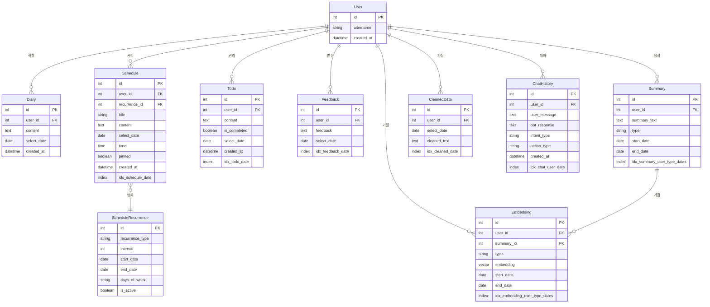

# MAIDDY AI 데이터베이스 ERD

## 테이블 설명

### User (사용자)
- 사용자 정보를 저장하는 테이블
- 모든 다른 테이블의 기준이 되는 메인 테이블

### ChatHistory (채팅 기록)
- 사용자와 챗봇 간의 대화 기록 저장
- 의도(intent_type)와 행동(action_type) 분석 결과 포함
- 시간순 조회를 위한 인덱스 포함

### ScheduleRecurrence (일정 반복)
- 반복되는 일정의 패턴 정의
- 일간, 주간, 월간 등 다양한 반복 유형 지원
- 반복 간격과 요일 지정 가능

### Diary (일기)
- 사용자의 일기를 저장
- 날짜별로 작성된 일기 내용 관리

### Schedule (일정)
- 사용자의 일정을 관리
- 제목, 내용, 날짜, 시간 정보 포함
- 고정된 일정 여부(pinned) 표시 가능
- 반복 일정과 연결 가능

### Todo (할일)
- 사용자의 할일 목록 관리
- 완료 여부 체크 가능
- 날짜별로 할일 관리

### Feedback (피드백)
- AI가 생성한 일일 피드백 저장
- 날짜별로 피드백 관리

### CleanedData (전처리된 데이터)
- 일기와 할일 등의 데이터를 전처리하여 저장
- AI 분석을 위한 정제된 텍스트 보관

### Summary (요약)
- 주간/월간 요약 정보 저장
- 시작일과 종료일로 기간 관리
- 요약 타입(주간/월간) 구분

### Embedding (임베딩)
- 요약 텍스트의 벡터 임베딩 저장
- 유사도 검색을 위한 벡터 데이터 관리
- Summary와 연결되어 해당 기간의 임베딩 저장

## 관계 설명

1. User (1) - (0..N) Other Tables
   - 한 사용자는 여러 개의 일기, 일정, 할일 등을 가질 수 있음
   - 모든 데이터는 반드시 하나의 사용자에 속함

2. Summary (1) - (0..N) Embedding
   - 하나의 요약은 여러 개의 임베딩을 가질 수 있음
   - 각 임베딩은 하나의 요약에 속함

3. Schedule (0..N) - (1) ScheduleRecurrence
   - 하나의 반복 패턴은 여러 일정에 적용될 수 있음
   - 일정은 선택적으로 반복 패턴을 가질 수 있음

## 인덱스
- `idx_chat_user_date`: 채팅 기록 검색 최적화
- `idx_schedule_date`: 일정 날짜별 검색 최적화
- `idx_todo_date`: 할일 날짜별 검색 최적화
- `idx_feedback_date`: 피드백 날짜별 검색 최적화
- `idx_cleaned_date`: 전처리 데이터 날짜별 검색 최적화
- `idx_summary_user_type_dates`: 요약 검색 최적화
- `idx_embedding_user_type_dates`: 임베딩 검색 최적화
